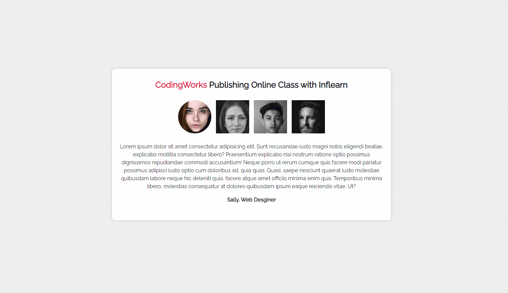
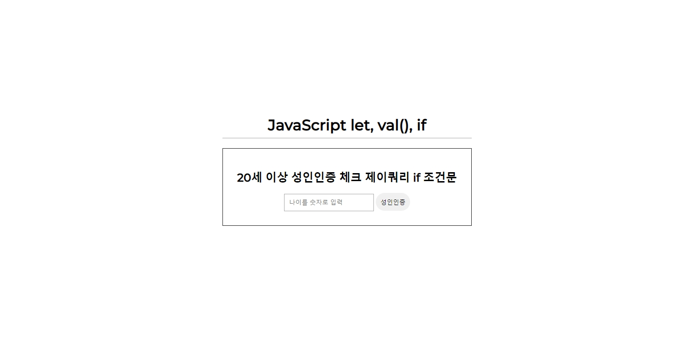
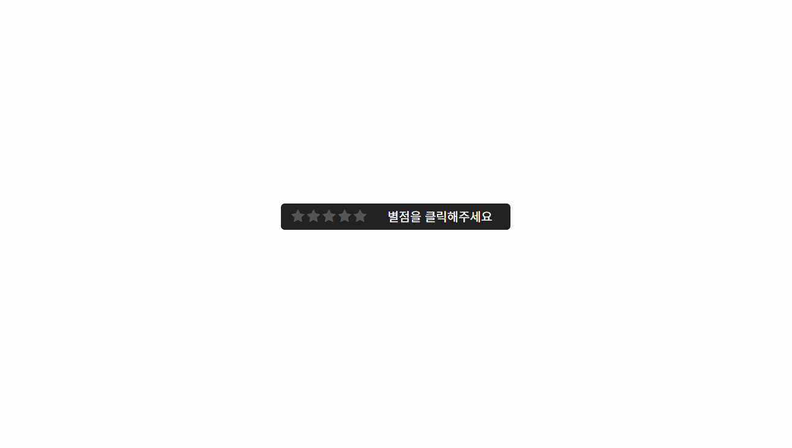
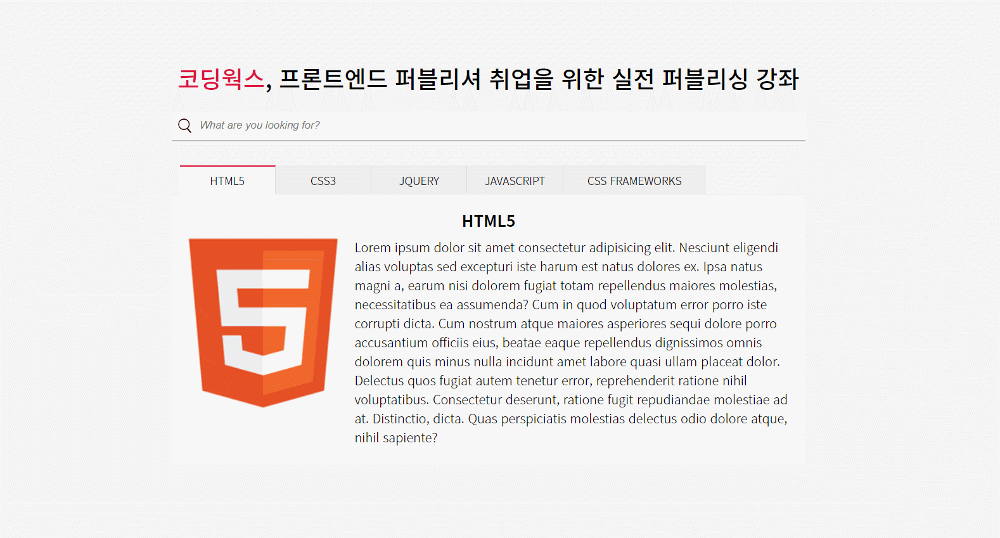
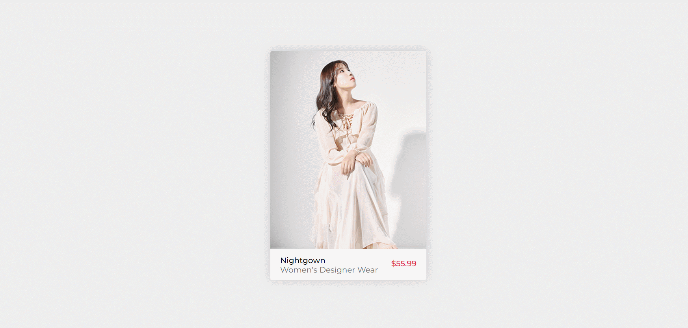
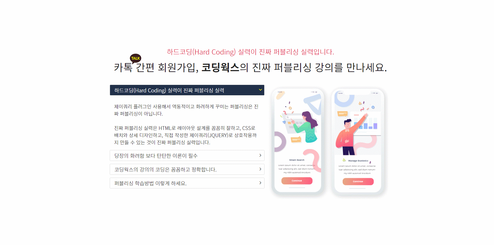

# publishing-portfolio-with-jQuery

### 탭 메뉴 콘텐츠

<a href="http://gaeng0.dothome.co.kr/publishing%20portfolio3/tabmenu.html" target="_blank">예제보기</a>

파일명 : tabmenu.html

 
 

### 20세 성인 체크

<a href="http://gaeng0.dothome.co.kr/publishing%20portfolio3/input.html" target="_blank">예제보기</a>

파일명 : input.html

 
 

### 별점주기

<a href="http://gaeng0.dothome.co.kr/publishing%20portfolio3/jquery1.html" target="_blank">예제보기</a>

파일명 : jquery1.html

 
 

### 탭 메뉴 콘텐츠2

<a href="http://gaeng0.dothome.co.kr/publishing%20portfolio3/tabmenu2.html" target="_blank">예제보기</a>

파일명 : tabmenu2.html

 
 

### 마우스 올리면 배경이미지 변경하기

<a href="http://gaeng0.dothome.co.kr/publishing%20portfolio3/jquery2.html" target="_blank">예제보기</a>

파일명 : jquery2.html

 
 

### 쇼핑몰 아이템 UI 호버 이펙트

<a href="http://gaeng0.dothome.co.kr/publishing%20portfolio3/jquery3.html" target="_blank">예제보기</a>

파일명 : jquery3.html

 
 

### 어코디언 콘텐츠 슬라이드

<a href="http://gaeng0.dothome.co.kr/publishing%20portfolio3/jquery4.html" target="_blank">예제보기</a>

파일명 : jquery4.html

 
 

### 어코디언 콘텐츠 슬라이드

<a href="http://gaeng0.dothome.co.kr/publishing%20portfolio3/jquery5.html" target="_blank">오디오 없는 예제보기</a> 
<a href="http://gaeng0.dothome.co.kr/publishing%20portfolio3/jquery5-1.html" target="_blank">오디오 있는 예제보기</a>

파일명 : jquery5.html

